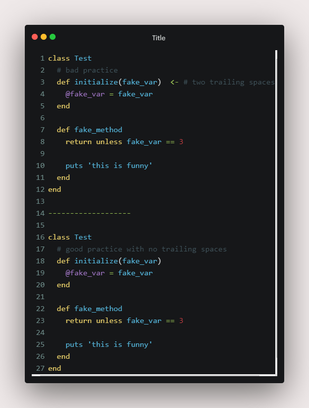
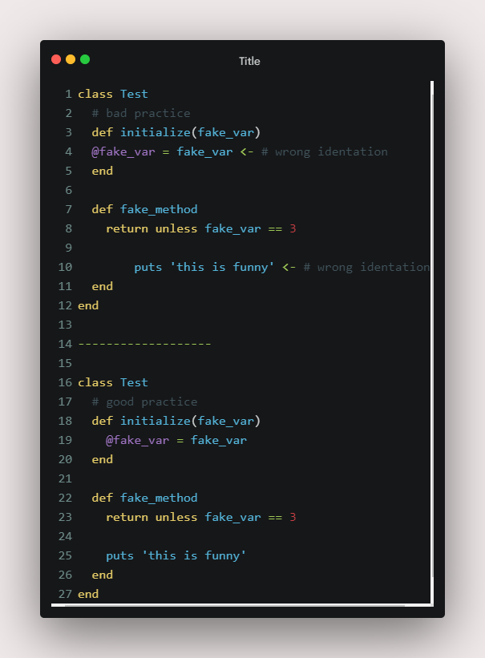
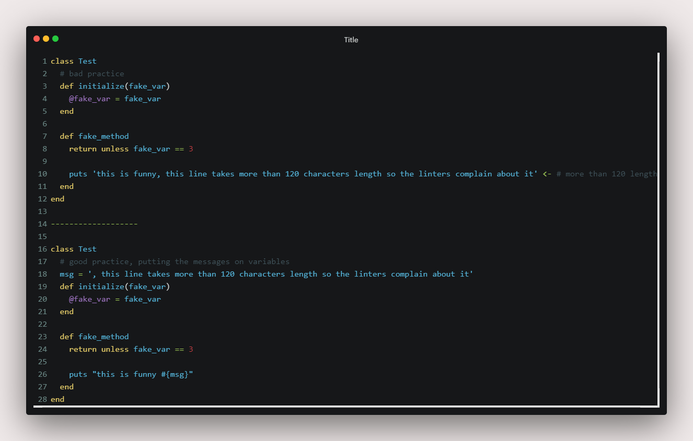
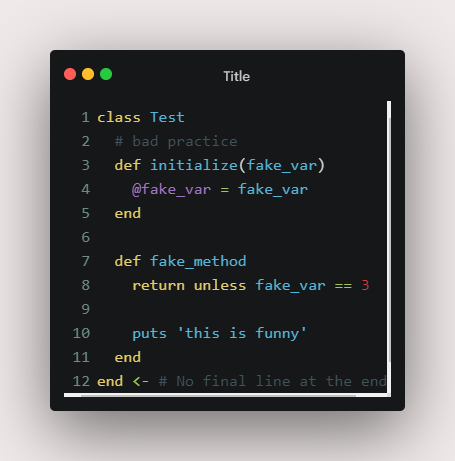
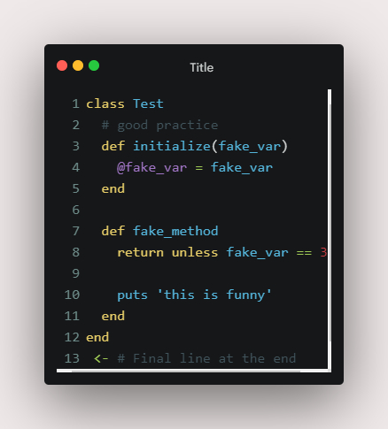

# Custom Linters for Ruby

A custom ruby linters to code in a better way!

# Getting started :

This is my Custom Ruby linters, I made it for Microverse for the Final project on the Ruby Module. Basically it clone some of the linters features, to write a better and clean code.

## Prerequisites :

    1- A Computer.
    2- Ruby installed

# Setup :

Please install ruby, you may follow this guide from Odin Project webpage [here](https://www.theodinproject.com/courses/ruby-programming/lessons/installing-ruby-ruby-programming).

## BUILT WITH

    -RUBY

## USAGE

    To run the code type follow this intructions:
        -Open your console.
        -Type 'bin/main.rb test.rb' <- this second file is necessary to test it.

## HOW TO CLONE THIS REPO?

    -Open your console
    -In there, copy and paste this command: "git clone https://github.com/FdI96/Custom-Ruby-Linter"

For more information about use the git clone, visit this [LINK](https://www.earthdatascience.org/workshops/intro-version-control-git/basic-git-commands/#:~:text=From%20your%20repository%20page%20on,like%20to%20clone%20your%20repository.)

# Documentation

## Information

In this section I represent the good and bad practices for each offense to fix all the custom linters error.

### Trailing White Space Detected

### Wrong Identation

### Reduce characters per line max 120

### Final newline missing

    Bad practice

    Good practice

### Inadequate empty line

## AUTHOR

👤 **Federico Ignacio Lopez Cechini**

- GitHub: [@FdI96](https://github.com/FdI96)
- Twitter: [@federicolopezc7 ](https://twitter.com/federicolopezc7)
- LinkedIn: [Federico Ignacio](https://www.linkedin.com/in/federico-ignacio-3285411a4/)

## SHOW YOUR SUPPORT

**Give a ⭐️ if you like this project!**

## 🤝 Contributing

Contributions, issues, and feature requests are welcome!

Feel free to check the issues page. Show your support

Give a ⭐️ if you like this project!

## Acknowledgement

Thanks to The Odin Project. Is the webpage where I learned most of the topics in this project.
Thanks to CodeImg web page, is where I did the code images. [LINK](https://codeimg.io/)

## 📝 Licensed MIT

This project is [MIT](https://github.com/FdI96/Custom-Ruby-Linter/blob/Development/LICENSE) licensed.
